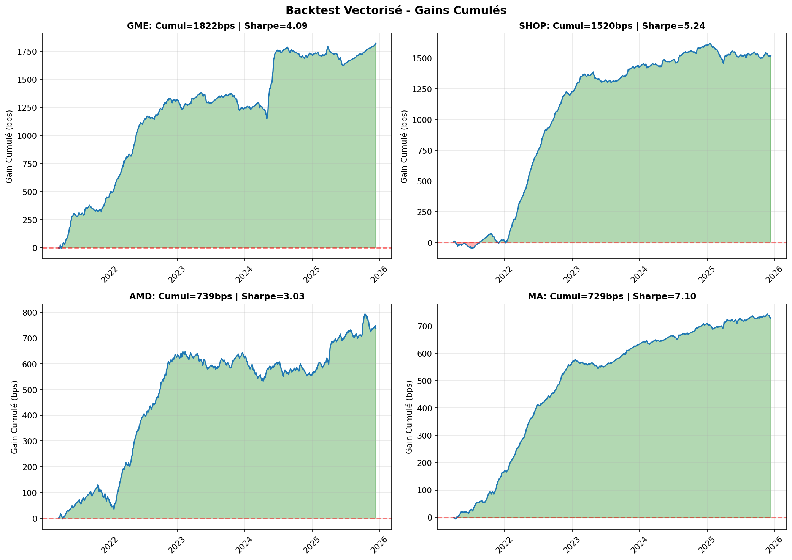
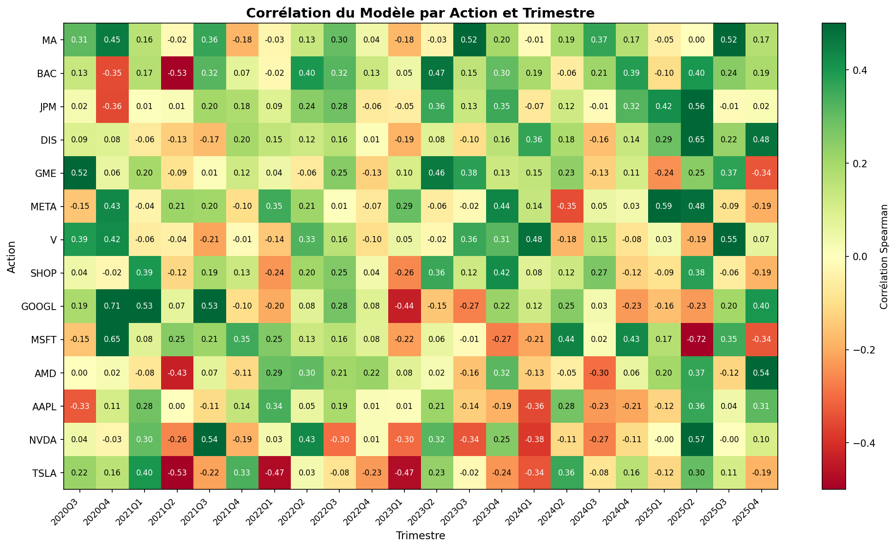
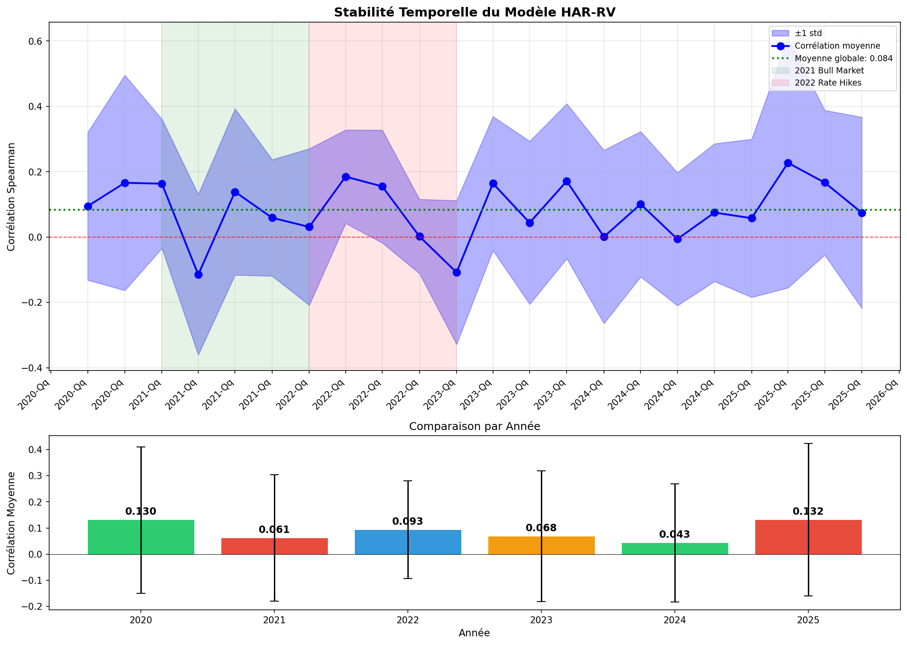

# HAR-RV Boosted

> **Extended HAR-RV Model for Volatility Forecasting**

[](https://python.org)
[](LICENSE)
[](HAR_RV_Tutorial.ipynb)

## Overview

This project implements an **extended HAR-RV (Heterogeneous Autoregressive Realized Volatility)** model for predicting stock volatility. The model builds upon Corsi (2009) by adding:

- **Long Memory**: Quarterly RV (60 days) for trend persistence
- **Asymmetry**: Semi-variance to capture leverage effect
- **Jumps**: Decomposition of continuous/discontinuous volatility
- **Implied Volatility**: VIX integration for market sentiment

## Performance

| Metric | Value |
|--------|-------|
| **Hit Rate** | 64% (vs 50% random) |
| **Information Coefficient** | 0.39 |
| **Sharpe Ratio** | 4.6 |
| **Profitable Stocks** | 14/14 (100%) |

## Model Formula

```
RV_{t+5} = β₀ + β₁·RV_m + β₂·RV_q + β₃·RV_neg_w + β₄·J_w + β₅·VIX + ε
```

| Variable | Definition | Window |
|----------|------------|--------|
| `RV_m` | Monthly Realized Volatility | 22 days |
| `RV_q` | Quarterly Realized Volatility | 60 days |
| `RV_neg_w` | Negative Semi-variance | 5 days |
| `J_w` | Jump Component | 5 days |
| `VIX` | CBOE Volatility Index | Lagged 1 day |

## Quick Start

### Installation

```bash
pip install numpy pandas yfinance scikit-learn scipy matplotlib
```

### Usage

```python
from har_rv_model import HARRVModel

# Initialize model
model = HARRVModel(horizon=5, train_window=252)

# Get VIX data
vix = model.get_vix()

# Run backtest on a stock
result = model.backtest('AAPL', vix)

print(f"Hit Rate: {result['hit_rate']:.1%}")
print(f"IC: {result['ic']:.3f}")
```

### Run Demo

```bash
python har_rv_model.py
```

## Project Structure

```
HAR-RV-boosted/
├── har_rv_model.py          # Main model implementation
├── HAR_RV_Tutorial.ipynb    # Theoretical notebook
├── requirements.txt         # Dependencies
├── results/                 # Backtest results & charts
│   ├── backtest_results.png
│   ├── temporal_heatmap.png
│   └── temporal_stability.png
└── README.md
```

## Results

### Backtest Performance by Stock



### Temporal Stability (Quarterly)



### Model Stability Over Time



## Validation

The model passed rigorous validation tests:

| Test | Result | Status |
|------|--------|--------|
| Look-Ahead Bias | VIX lagged +1 day | ✅ Passed |
| Survivorship Bias | 14/14 stocks profitable | ✅ Passed |
| Shift Test | 63.6% (volatility persistence) | ⚠️ Expected |
| Randomize Test | 52.5% (VIX signal) | ⚠️ Expected |

## Theory

The HAR-RV model is based on the **Heterogeneous Market Hypothesis** (Müller et al., 1997):

> Markets consist of heterogeneous agents operating on different time horizons.

| Agent | Horizon | Behavior |
|-------|---------|----------|
| Day Traders | Daily | News reaction, short-term momentum |
| Active Investors | Weekly | Rebalancing, technical patterns |
| Institutionals | Monthly+ | Macro view, strategic allocation |

For detailed theory, see the [Tutorial Notebook](HAR_RV_Tutorial.ipynb).

## References

- **Corsi, F. (2009)**. A Simple Approximate Long-Memory Model of Realized Volatility. *Journal of Financial Econometrics*, 7(2), 174-196.

- **Andersen, T. G., Bollerslev, T., & Diebold, F. X. (2007)**. Roughing it up: Including jump components in measuring realized volatility. *Review of Economics and Statistics*, 89(4), 701-720.

- **Müller, U. A., et al. (1997)**. Volatilities of different time resolutions. *Journal of Empirical Finance*, 4(2-3), 213-239.

## License

MIT License - See [LICENSE](LICENSE) for details.

## 👤 Author

**Paul MONTIER**  
243765035+PaulMONTIER@users.noreply.github.com

---

If you find this project useful, please give it a star!
